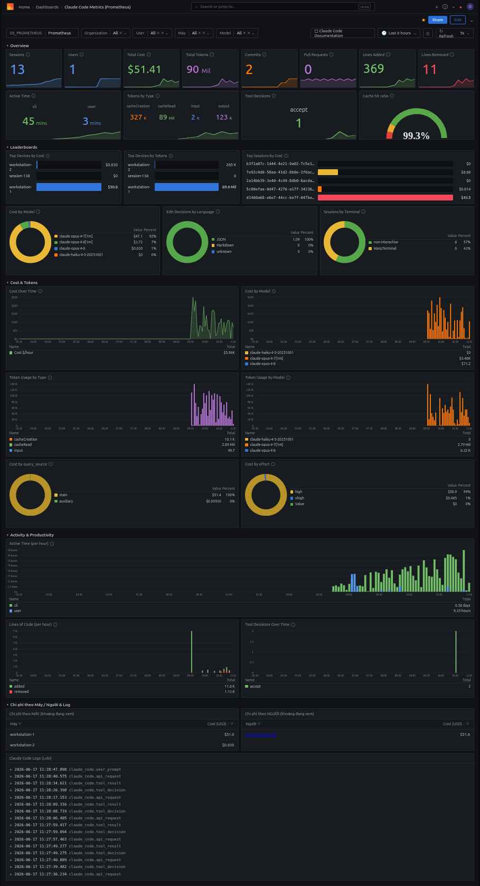

# claude-code-observability

Collect Claude Code usage — cost, tokens, sessions, and logs — from any number of
machines into one place and view it in Grafana. Every machine running Claude Code
pushes its metrics to a central server, so a single dashboard shows who is using
how much.

The stack is small: OTel Collector → Prometheus (metrics) + Loki (logs) → Grafana,
all behind nginx with TLS.

## Before you deploy: replace the placeholders

The repository ships with all private details stripped out, so the code contains
`<...>` placeholders. Search for them and substitute your own values — they appear
in `nginx/*.conf`, `docker-compose.yml`, `satellite/install-otel.*`,
`scripts/add-device.sh`, and the docs.

| Placeholder | Meaning | Example |
|---|---|---|
| `<OTEL_DOMAIN>` | Domain machines push metrics to (OTLP) | `otel.example.com` |
| `<GRAFANA_DOMAIN>` | Domain for the Grafana dashboard | `grafana.example.com` |
| `<SERVER_PUBLIC_IP>` | Public IP of the central host | `203.0.113.10` |
| `<OFFICE_IP>` | IP to allowlist if you want to restrict access (nginx `allow`) | `198.51.100.20` |

Machine names and user names don't need editing in the repo — you pass them in when
you run `add-device.sh` / `install-otel.*`.

## How it works

```
Satellite machine (Claude Code, built-in OTLP exporter)
   │  HTTPS 443 + Bearer token (one token per machine)
   ▼
<OTEL_DOMAIN>  ── nginx (TLS) validates token ──► OTel Collector :4318 (internal)
                                                   ├─► Prometheus (metrics)
                                                   └─► Loki (logs)
                                                         ▼
<GRAFANA_DOMAIN> ── nginx (TLS) ──► Grafana :3000 (dashboard, login)
```

Key points: the stack runs on the central host (`<SERVER_PUBLIC_IP>`) and reuses an
existing nginx + certbot setup. The Collector, Prometheus, Loki, and Grafana all
bind to `localhost` only; nginx is the sole process exposed on port 443. TLS uses a
single certificate named `claude-code-observability` (its SAN covers both domains),
renewed automatically by Let's Encrypt.

## What's on the dashboard

The "Claude Code Metrics (Prometheus)" dashboard groups everything into sections,
with a filter bar at the top for Organization / User / Machine / Model and a time
range.



- **Overview** — at-a-glance totals: Sessions, Users, Total Cost, Total Tokens,
  Commits, Pull Requests, Lines Added/Removed. Plus Active Time (split into CLI vs
  user), Tokens by Type (cacheCreation / cacheRead / input / output), Tool Decisions
  (accept/reject), and a Cache hit ratio gauge.
- **Leaderboards** — rankings: Top Devices by Cost, Top Devices by Tokens, Top
  Sessions by Cost; plus three donut charts: Cost by Model, Edit Decisions by
  Language, Sessions by Terminal.
- **Cost & Tokens** — time series: Cost Over Time, Cost by Model, Token Usage by
  Type, Token Usage by Model, then Cost by `query_source` and by `effort`.
- **Activity & Productivity** — Active Time per hour, Lines of Code per hour
  (added/removed), and Tool Decisions over time.
- **Cost by Machine / User & Logs** — two tables ranking cost per machine and per
  user over the selected range, alongside a Claude Code Logs panel sourced directly
  from Loki.

Everything is live for the selected time range; changing a filter updates every
panel.

## Current status (last verified 2026-06-15)

At the most recent check everything was healthy: all four containers running, Claude
Code metrics flowing in (cost, tokens by type, sessions, and active time reach
Prometheus, and Grafana queries return data). TLS is valid on both domains, and the
ingest path enforces tokens correctly — a missing or wrong token returns 401, a valid
one returns 200 to the Collector. An end-to-end test through `https://<OTEL_DOMAIN>`
landed data in Prometheus, with the `machine` label distinguishing each host.

The token map is currently empty (no machines added yet); add them with `add-device`
below.

## Operating the server

```bash
cd projects/observability
sudo docker compose ps              # status
sudo docker compose up -d           # start (comes back automatically after reboot via restart: unless-stopped)
sudo docker compose logs otel-collector --tail=50
```

The Grafana admin password lives in `.env` (chmod 600, never commit it). Change it
after your first login. Open the dashboard at `https://<GRAFANA_DOMAIN>` (user
`admin`); the dashboard "Claude Code — Usage" shows cost, tokens, and sessions per
machine and per user, with Loki logs alongside.

## Adding / removing a device (one token per machine)

Run on the server, as root:

```bash
cd projects/observability
sudo bash scripts/add-device.sh machine-name        # generate a token, write the nginx map, reload, print the installer for that machine
sudo bash scripts/revoke-device.sh machine-name     # remove it: that machine is blocked immediately
```

When `add-device` finishes it prints the token, a `settings.json` snippet, and a
ready-to-run one-line install command for that specific machine — copy it over and
run it.

## Installing a satellite machine (one-click)

Copy the `satellite/` folder to the machine you want to monitor, then run it.

Ubuntu / Linux / macOS:
```bash
OTEL_TOKEN='tok_...' bash install-otel.sh
# optional: OTEL_MACHINE='machine-name' OTEL_USER='user-name'
```

On Windows, double-click `install-otel.bat`, or run
`powershell -ExecutionPolicy Bypass -File install-otel.ps1 -Token 'tok_...'`.

The script writes to `~/.claude/settings.json` (preserving your existing config),
fills in `machine=hostname` and `user=login`, then tests the connection and reports
OK/Fail. After that, just open Claude Code as usual — data is sent automatically.

## Security

The ingest endpoint is publicly reachable but requires a per-machine token to get
through, and each machine can be revoked individually; the Collector itself is never
exposed to the internet. Grafana is protected by login. To lock it down further,
uncomment `allow <IP>; deny all;` in `nginx/grafana.conf` (an office-IP allowlist),
then `sudo cp` it into place and run `sudo nginx -t && sudo systemctl reload nginx`.

By default Claude Code does not send prompt content or tool arguments — only usage
metrics and the user's email. Do not enable `OTEL_LOG_USER_PROMPTS` or
`OTEL_LOG_TOOL_DETAILS` in production unless you genuinely need them.

## Changing domains / environment

Domains are set in three places: `nginx/*.conf` (`server_name`),
`satellite/install-otel.*` (the default `OTEL_ENDPOINT`), and Grafana's
`GF_SERVER_ROOT_URL` environment variable.

Prometheus metric names (confirmed against the running stack):
`claude_code_cost_usage_USD_total`, `claude_code_token_usage_tokens_total` (with a
`type` label), `claude_code_session_count_total`,
`claude_code_active_time_seconds_total`. Labels commonly used for filtering:
`machine`, `user_id`, `user_email`, `model`, `query_source`.
